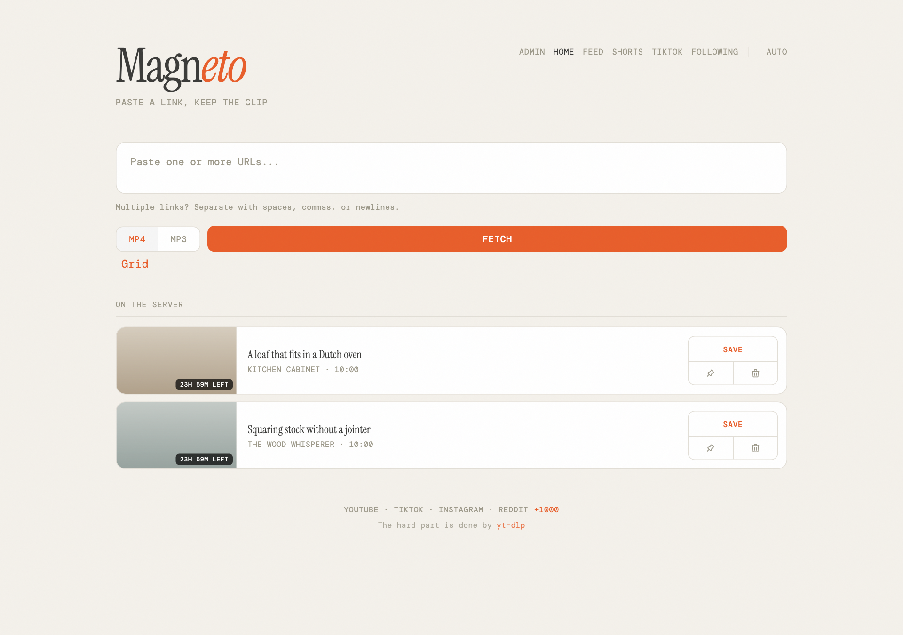

# Magneto

A self-hosted video downloader and reader for a household. Paste a link and keep
the file for a day, or follow channels and accounts and read what they publish
from your own server.

Forked from [averygan/reclip](https://github.com/averygan/reclip), which is the
downloader this grew out of. What has been added since: a feed of followed
YouTube channels, a vertical reader for shorts and TikTok, accounts behind a
forward-auth proxy, public share links, retention with pinning, and an admin
page. The download side still works the way the original does.



## Quick start

```bash
git clone <this repository>
cd magneto
docker compose up -d
```

Then open http://localhost:8899. The compose file builds the image, keeps the
files and the database in two named volumes, and restarts the container with the
host. Everything is configured there, so editing it and running `docker compose
up -d` again is the whole administration.

To run a published version instead of building one:

```bash
docker run -d -p 8899:8899 \
  -v magneto-downloads:/app/downloads -v magneto-data:/app/data \
  ghcr.io/cedhuf/magneto:latest
```

To run it from source, on a machine that already has yt-dlp and ffmpeg:

```bash
brew install yt-dlp ffmpeg    # or apt install ffmpeg && pip install yt-dlp
./magneto.sh
```

Nothing is enabled beyond the downloader. The feed, the shorts page, TikTok and
sharing are each off until an environment variable asks for them, because each
one is a thread that talks to somebody else's servers on its own. See
[configuration](docs/configuration.md).

## What it does

Downloads from [anything yt-dlp supports](https://github.com/yt-dlp/yt-dlp/blob/master/supportedsites.md),
as MP4 or MP3, one URL or a list of them, with a resolution picker that defaults
to formats which play on a phone and a television rather than only in a browser.

Follows YouTube channels and TikTok accounts, and reads them on three pages: a
grid for long videos, a full-height reel for upright ones, and one page listing
who you follow and what following them costs.

Keeps files for a day and rows for good, so a download can be restarted from the
card that outlived it. Pins hold a file longer within a limit the admin sets.

Runs for several people behind a forward-auth proxy, where each account has its
own entries, its own follows and its own history.

## Releases

Versions come from the commit messages. Every commit says what it changes with a
[Conventional Commits](https://www.conventionalcommits.org) prefix, and
release-please keeps a pull request open that holds the next version number and
the changelog it has worked out. Merging that pull request tags the version,
publishes the release and builds the image. Nothing is written twice and nothing
is decided by hand except when to press the button.

Images are at `ghcr.io/cedhuf/magneto`, tagged with the version and `latest`.
The version reaches the running app and `/admin` shows it.

## Documentation

- [Using it](docs/usage.md): the pages, following, sharing, installing it on a
  phone
- [Configuration](docs/configuration.md): every environment variable, admin,
  the proxy, and how to stay welcome at a provider
- [How it is built](docs/design.md): modules, stylesheets, retention, codecs,
  stack

## Disclaimer

For personal use. Respect copyright and the terms of service of the platforms
you download from.

## License

[MIT](LICENSE)
